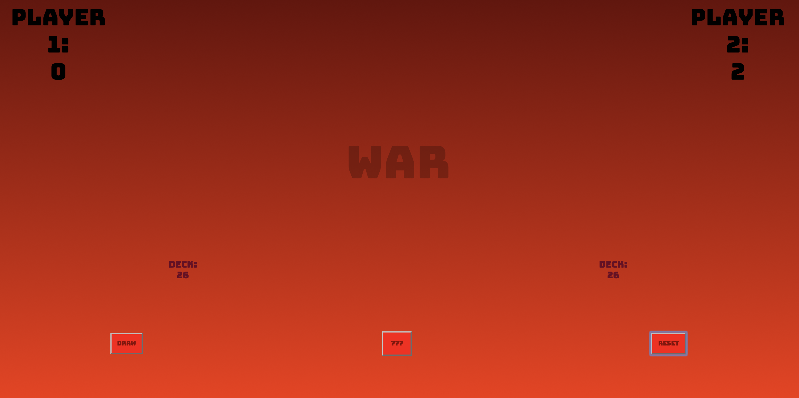
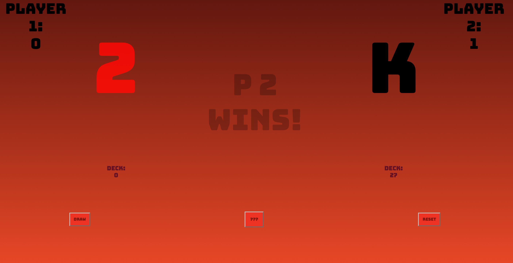
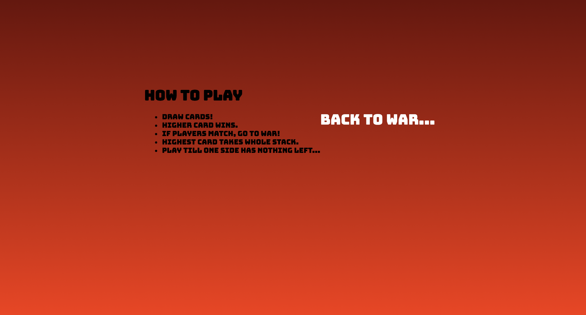

# Game of War
## Intro
Game of War is a minimal, stylized version of the classic card game War. They say only the dead see the end of war...
## How To Play
Gameplay is very simple:
* The deck is split evenly and each player draws at the same time.
* Whoever has the highest card takes both cards. 
* If cards match, three more are drawn face down, and both players draw again. Whoever has highest wins the entire pile. This goes as long as matches are turned.
* The game ends when one player has no more cards left or not enough to go to War.
## Screenshots

## Development
### Technologies Used
* Javascript/jQuery
* HTML/CSS

This game was created by Dylan Marcus Corbett 2017.
## Future plans
* Implement more graphic features for Go To War.
* Add more speed to the animations, no lag time between.
* Animate battle.